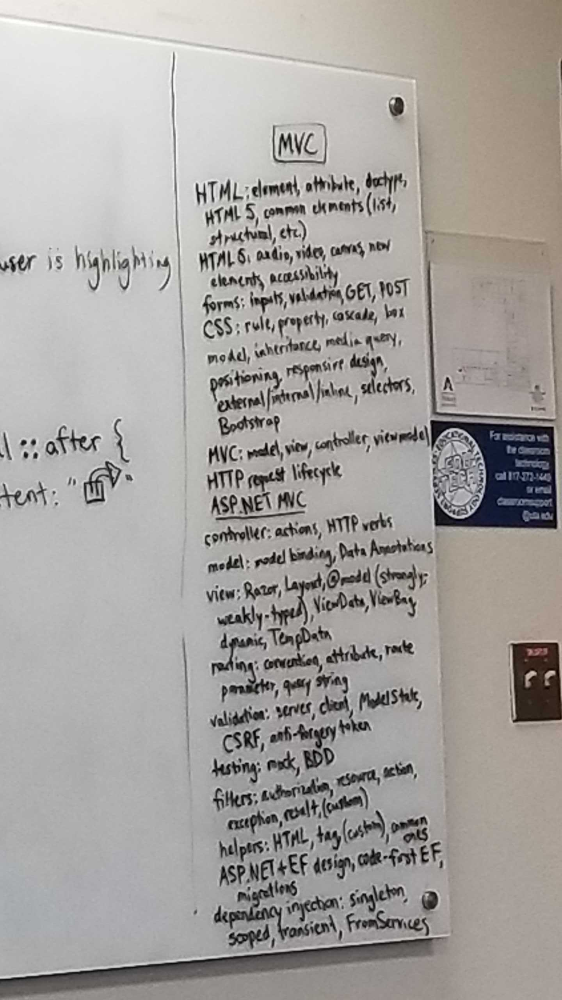

# 3-04-19 Notes
- Take the 60 questions 40 mins quiz
- Take the written assessment
- Do 1 on 1
- Go on a Death March on Project 0 for rest of the day
- VS shortcut `Shift + Alt + .` able to select similar to your selection
	- equivalent to ctrl + D in Sublime
- Nothing else much really
- Behavior Driven Development striked off list of what we need to cover
- 

## Questions
- cannot implicitly convert type 'decimal?' to 'decimal'
- System.InvalidOperationException: 'The instance of entity type 'StoreOrder' cannot be tracked because another instance with the same key value for {'OrderId'} is already being tracked. When attaching existing entities, ensure that only one entity instance with a given key value is attached. Consider using 'DbContextOptionsBuilder.EnableSensitiveDataLogging' to see the conflicting key values.'
