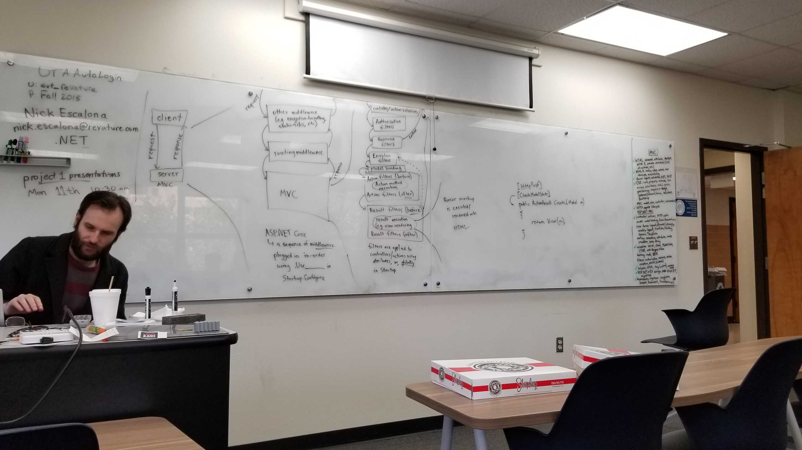

# revature 3-08-19

## More MVC stuffs
- ways to get data from the controller to the view
	1. strongly typed view the model
		- often will be a view model
		- view can only take one model, so if you need several
			- either that's a collection type of some kind or
			- make a new view model that contains the several you need
	2. ViewData - a key-value pair dictionary
		- this obj is reachable via a property on Controller
		- can assign values in controller and access in the view
		- (during the same HTTP request! It's cleared between requests)
		- Designed around request response, ViewData disappears betweens requests
		- e.g. `ViewData["numOfMovies"] = viewModel.Count;`
			- then within some view we use like this, relying on this not as good
			- `<h4>Num of movie: @ViewData["numOfMovies"]</h4>`
	3. e.g. `ViewBag.numOfMovies = viewModel.Count`
		- `<h4>Num of movie: @ViewBag.numOfMovies</h4>`
		- **ViewBag** a different way to access ViewData = "dynamic" type.
			- set properties instead of using indexing syntax w/ string.
			- an obj whose operations will be resolved at runtime
			- dynamic type - compile time type checking turned off
				- we can add new props to that obj at any time
	4. TempData - a K V pair dictionary
		- the value inside it survives across req "magically"
		- by default stored using cookies sent to the client
		- which are then sent back to server on subsequent req
			- but we can configure other providers for TempData in Startup
		- e.g. we can use this to incrementally build some model
			- needing many forms to be submitted, not just one
		- with regular ["key"] access, the value you access gets deleted.
			- only after the current request, circumvent with methods 
				- .Peek("key")
					- access value w/o marking for deletion
				- .Keep("key")
					- unmarks a value for deletion
		- 	```cshtml
			<h4>Counter (with TempData): @TempData["counter"]</h4>
			@{
				if((int)TempData["counter"] <= 3)
				{
					TempData.Keep("counter");
				}
			}
			@{
				// within controller
				if(TempData.ContainsKey("counter"))
				{
					TempData["counter"] = ((int)TempData["counter"]) + 1;
				} 
				else
				{
					TempData["counter"] = 0;
				}
			}
			```
		- the other way we can keep data around to incrementally build something like
			- an order is with hidden form fields
		- 	```cshtml
			<form asp-action="Post">
			@for(int i = 0; i< Model.Count; i++)
			{
				@Html.Hidden($"[{i}].Id", Model[i].id)
			}
			<input type = "submit" value="Post" class="btn btn-default"/>
			</form>
			```
- attributes
	- routing in contrast to global/convention based routing
		- e.g. `[/{num:int?}]`
			- this skips initial controller part with /
		- e.g. `[index/{num:int?}]`
			- allows us to input some route param (to counter for e.g.)
		- e.g. `[Route("[controller]/asdfasdf/ShowAllMovies")]`
		- `public ActionResult Index([FromQuery] int num){}`
			- prev method won't work, but if you include `?` query string for num, it will work
			- fix previous ambiguous routes with `Route["Films/[action]"]`
			- we have [FromQuery] to get that param from query string ("?key=val" in URL)
			- we have [FromForm]/[FromBody] to get it from a form submission
			- we have [FromRoute] to get it from route params (defined in attr or global route)
			- we have [FromServices] to ask for some service exactly like constructor params do
- strategy for unit testing controllers
	- strategy to make fakes to substitute for those dependencies, not scalable
	- fakes substitute for dependencies of obj we want to test
		- making those tests actual unit tests, assume fake works
		- simple in logic
	- 	```csharp
		// one method per test class probably, let's test create with CreateTest.cs
		// ... using blah blah stuffs
		public class CreateTests
		{
			// you can use this to help you create try catch for exceptions even if not used for tests (check if (!ModelState.isValid) {return View(viewModel);})
			[Fact]
			public void GetCreateReturnsEmptyViewWithEmptyGenres()
			{
				// my controller needs a repo
				// my automated tests should not alter my actual app's db
				// I could try to provide a MovieDBRepo.. but needs DBContext
				//		I could use InMemory or SQLite for that DbContext...
				// but now we are quite far from "unit test"
				//		that would really be an "integration test"
				// so how can we unit test
				// I do have a MovieRepository that doesn't need DbContext..
				//		still would be integration test
				//arrange
				var fakeRepo = new FakeMovieRepo();
				var sut = new MoviewsController(fakeRepo);
				// i need some IMovieRepo that gives GetAllGenres as empty
				//act
				// remember to add NuGet package, just to see that type
				// Microsoft.AspNetCore.Mvc
				ActionResult result = sut.Create();
				//assert
				// ... that the return value is actuall a viewResult
				// could rely on thrown exceptions from downcast
				//var viewResult = (ViewResult)result; // throws exception if fails
				// here we cast and assert that the cast worked
				var viewResult Assert.IsAssignableFrom<ViewResult>(result);
				// assert that the view is Create
				//Assert.Equal("Create", viewResult.Viewname); //needs more work
				// assert that the model is a MovieViewModel
				var viewModel = Asset.IsAssignableFrom<MovieViewModel>(viewResult.MSOMETHING)
				// assert that the genres is empty
				Assert.Empty(viewModel.Genres);
			}
		}
		public class FakeMovieRepo : IMovieRepository
		{
			public IEnumerable<Genre> AllGenres() => new List<Genre>();
			//... others
		}
		```
	- Mocks are easier to set up than fakes
		- NuGet install Moq to test your controls
		- 	```csharp
			//similar as above
			public void GetCreateReturnsGenresView()
			{
				//arrange
				var genres = new List<Genre> {new Genre {Id = 1, Name="Action"}};
				var mockRepo = new Mock<IMovieRepository>();
				// set up mock object
				mockRepo.Setup(r => r.AllGenres()).Returns(genres);
				// gives the set up mock obj to the obj to be tested
				var sut = new MoviesController(mockRepo.Object);
				//act
				var result = sut.Create();
				//assert
				var viewResult = Assert.IsAssignableFrom<ViewResult>(result);
				// IsAssignableFrom also does a null check
				var viewModel = Assert.IsAssignableFrom<MovieViewModel>(viewResult.Model);
				// we can compare that 2 collections have equal elements with
				// Assert.True and LINQ sequenceEqual
				//		be aware uses == for equality, we want value equality for ref types here
				// can annotate with expected: actual:
				Assert.Equal(expected: genres.Count, actual: viewModel.Genres.Count);
				for (var i = 0; i < genres.Count; i++)
				{
					Assert.Equal(expected: genres[i].id, actual: viewModel.Genres.Id);
					Assert.Equal(expected: genres[i].Name, actual: viewModel.Genres.Name);
				}
				// some more complex stuffs with mock setup...
				mockRepo.SetUp(x => x.AllMoviesWithGenre(null)).Returns(new Movie[0]);
				mockRepo.SetUp(x => x.AllMoviesWithGenre(null)).Throws<ArgumentNullException>();
				// we give params to the lambda we setup, It.IsAny, It.IsNotNull, ...
				mockRepo.SetUp(x => x.AllMoviesWithGenre(It.IsNotNull<Genre>())).Returns(new Movie[0]);
				// for async methods
			}
			```

## Client Server MVC Pipeline
- **needs to know the order and the filter orders, watch it'll be on the quiz**
	- week 5 Rest services stuffs uses this
- [Filter docs](https://docs.microsoft.com/en-us/aspnet/core/mvc/controllers/filters?view=aspnetcore-2.2)
- [Client] -requests-> [Server(MVC)]
- [Client] <-response- [Server(MVC)]
- From Server
	- ASP.NET Core
		- a sequence of middleware
			- plugged in in-order using .Use__ in Startup.Configure
- From Client's request
	- -> other middleware
		- e.g. exception-handling, static-file serving, etc...
	- -> routing middleware
	- -> MVC
	- then response goes upward <-
- From MVC
	- -> controller/action selection
	- -> Authorization filters
		- filters are applied to controllers/action using attributes or globally in startup
			- alternative to global filters is middleware
	- -> Resource filters
		- could directly return response to -> MVC
	- -> exception filters
	- -> Model Binding
	- -> Action Filters
		- Action Filters (before)
		- Action method execution
		- Action filters (after)
	- -> result filters
		- result filters (before)
		- result execution (e.g. view rendering)
		- result filters (after)
		- sends response to -> Exception filters or -> MVC
	- any filters could abort and go back to MVC
- From result execution
	- Razor markup is executed/rendered into HTML



## Adding async
- look at Nick's code later.. too many file changes yay!
	- made an example for allmovies and delete
	- 	```csharp
		// example starting with DeleteMovie
		public async Task DeleteMovieAsync(int id)
		{
			_dbContext.Movie.Remove(MovieById(id));
			// everytime you call a method with async, you use await
			await _dbContext.SaveChangesAsync();
			// now to apply stuffs at the right files now..
		}
		```
- remember async and await is used
- hungry, sugar crashed, i smell kaffee, sleepy, apples, apples, apples, apples, app...

## Project 1
- would like us to use Mock for testing
- be great if you can work with Async 
	- works from bottom level
- note, if you use TempData, user must accept cookies on browser or else the site might break!
- If lazy, use the default template that has the create, delete, update, read stuffs
- STEPS TO TAKE
	- look in startup.cs and look at my comments
	- 	```
		{
			"ConnectionStrings": {
				"ClothingStoreDB": add your connection string here
			}
		}
		```
	- Scaffold-DBContext "Server=tcp:ly1902sql.database.windows.net,1433;Initial Catalog=Project0;Persist Security Info=False;User ID={your_id};Password={your_password};MultipleActiveResultSets=False;Encrypt=True;TrustServerCertificate=False;Connection Timeout=30;" Microsoft.EntityFrameworkCore.SqlServer -Project ClothingStore.Context


## EXTRAS
- shortcut: `ctrl + r, ctrl + r` twice on some variable name to rename all that uses it
- `dotnet user-secrets list` to grab user secret stuffs from bash/terminal
- exists something called partial views `<partial name="_CookieConsentPartial"/>`
	- encapsulate a view unit and reused in a bunch of places
	- has `<partial  and @HtmlPartial(`
	- for now sections and partials we don't need to use
- remember to include in your `manage user secrets` your config files